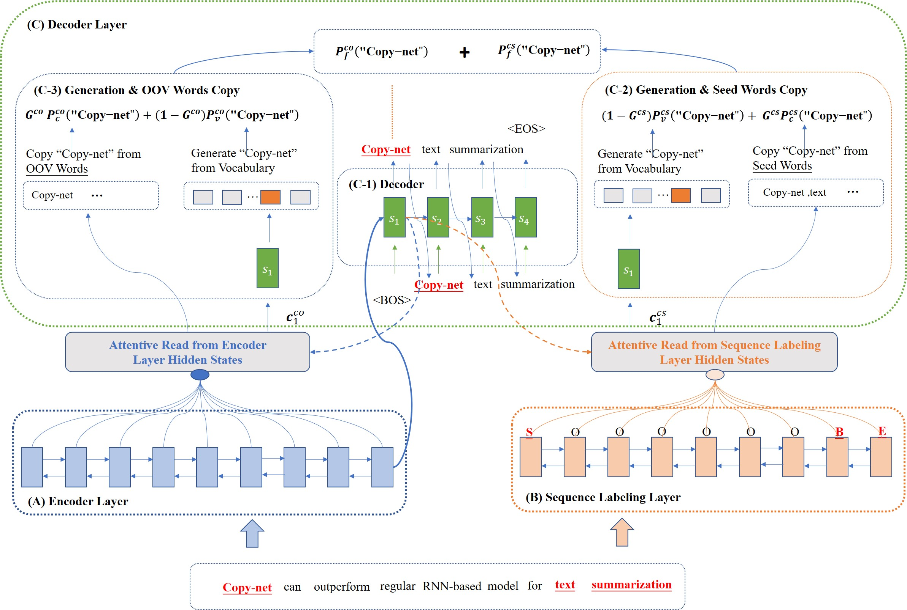

# AKG-DualCopyNet

A source code for the Coling 2022 paper [Automatic Keyphrase Generation by Incorporating Dual Copy
Mechanisms in Sequence-to-Sequence Learning]().Our Implementation is built on the starter code
from https://github.com/kenchan0226/keyphrase-generation-rl and https://github.com/jiacheng-ye/kg_one2set



## Requirements

```shell
nltk==3.7
numpy==1.21.5
scikit_learn==1.0.2
torch==1.11.0
```


## DataSet


The datasets can be downloaded
from [here](https://drive.google.com/file/d/1wDZjybrAThhLstVe_hh0fQmKgZbNQgB6/view?usp=sharing), which are the tokenized
version of the datasets provided
by https://github.com/kenchan0226/keyphrase-generation-rl :

* The testsets directory contains the four datasets for testing (i.e., inspec, nus, and semeval and kp20k), where each
  of the datasets contains test_src.txt and test_trg.txt.

## Data Processing

```python
python preprocess.py - data_dir / your_path / kp20k_sorted - save_data_dir / your_path / data
```

## Train Model

```shell
sh scripts/train_dcatseq.sh
```

## Evaluation Model

```shell
python predict.py
 -vocab data/kp20k_preprocess
 -src_file data/cross_domain_sorted/word_semeval_testing_context.txt
 -pred_path data/pred/$dataset
 -max_length 60
 -remove_title_eos
 -beam_size 200
 -n_best 1
 -batch_size 8
 -model_name dcat_seq
 -model_path data/kp20k_exp
```

| Dataset | beam size | max length |
|:--------|----------:|:----------:|
| nus     |       200 |     60     |
| semeval |       200 |     30     |
| inspec  |       200 |     60     |
| kp20k   |        20 |     30     |


```shell
python evaluation.py
-pred_file_path data/pred/${dataset}/predictions_dcat_seq.txt
-src_file_path data/cross_domain_sorted/word_semeval_testing_context.txt
-trg_file_path data/cross_domain_sorted/word_semeval_testing_allkeywords.txt
-filtered_pred_path data/pred/semeval
-exp_path data/pred/semeval
-model_name dcat_seq
```


